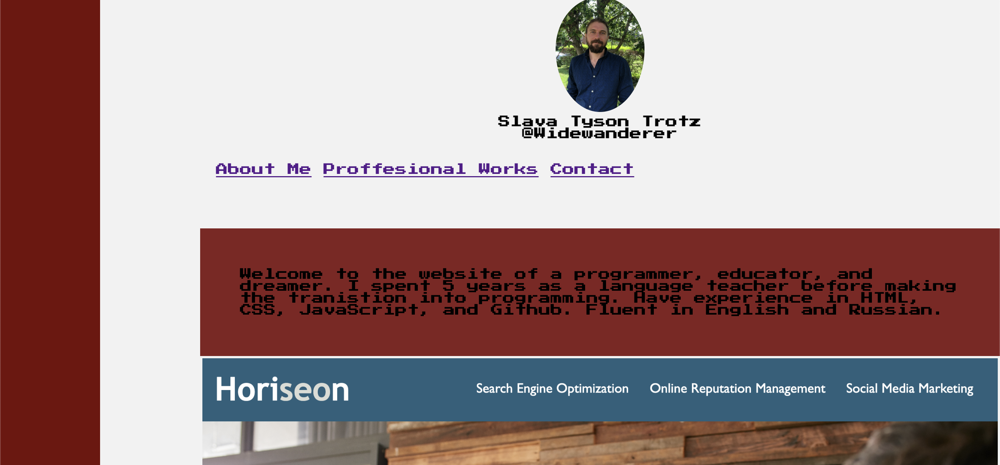
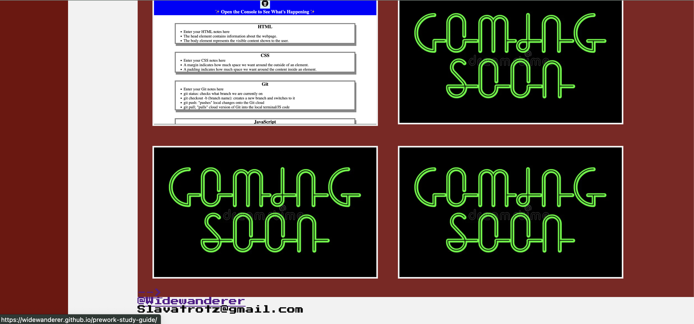

# The Profile of Magos Slava Trotz

Created profile website to display professional programming works.

### Description

Created profile website for displaying of programming works with use of HTML,CSS, and GitHub. Features include;
-- HTML
-- CSS
--
-- Used Flex boxes to create webpage strucure and organize page content
-- Created reactive images with links to completed works
-- created local navigation links to various points in the webpages
-- created local navigation to other webpages

- Added alt descriptions to images
  -- - Used github add, commits, and pushes to record changes
- Created README file

### To Do

-- Adjust Nav link positioning
-- implement full hover effects
-- Further adjust Flex-boxes
-- Emblem in top left?
-- Light and dark mode?

**GitHub Repository Link**
https://github.com/Widewanderer/Portfolio-Site/settings/pages

**Profile Website**
https://widewanderer.github.io/Portfolio-Site/

### Screenshots

## 
